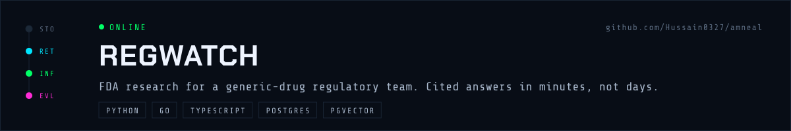
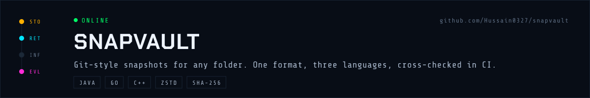

```console
$ whoami
raja hussain · cs + econ @ nyu · new york

$ cat focus
storage engines · retrieval · llm inference · eval
```

[Portfolio](https://raja-builds-ai.vercel.app/) ·
[LinkedIn](https://www.linkedin.com/in/raja-hussain-ai) ·
[rajahh7865@gmail.com](mailto:rajahh7865@gmail.com)

[](https://github.com/Hussain0327/amneal)

Built in 2026 for a generic-drug regulatory affairs team at Amneal.
An analyst used to spend days reading FDA guidances to answer one question.
RegWatch answers in minutes, with the source and page behind every fact.

- Pins each question to one drug before retrieval, so answers never mix
  products.
- Refuses to state a fact without a source. A test enforces the rule, not
  the prompt.
- Says "not found" in plain words when the evidence is thin.
- Compliance Studio, in progress: reviewers run internal CMC drafts against
  ICH, USP, 21 CFR, and SOPs, with each finding pinned to the exact text.

[](https://github.com/Hussain0327/snapvault)

Git-style snapshots for any folder. Nothing leaves your machine.
One binary format, three implementations, and they read and write each
other's repositories byte for byte.

- Java 21 first. Froze the format spec, rebuilt in Go with concurrent
  hashing, then wrote a C++20 integrity checker against the same spec.
- Content-addressed SHA-256 objects. Same bytes, same hash, stored once.
- Format v2 adds delta compression and zstd. CI fails the build if the
  interop fixture shrinks by less than 50%.
- `snapvault find`: BM25 plus static embeddings, fused. A committed
  100-question set holds the quality floor in CI. Recall 0.961, MRR 0.891
  at k=10.

[](https://github.com/Hussain0327/cloudsearch)

Hybrid search over AWS documentation with streamed, cited answers.
No API keys. Runs on your laptop.

- Python crawls and chunks the docs by structure, then embeds with
  BGE-large.
- Go fans out vector and keyword search concurrently and fuses them with
  Reciprocal Rank Fusion.
- Postgres holds both indexes, pgvector HNSW and tsvector GIN. No separate
  vector database.
- Llama 3.2 through Ollama streams the answer with numbered citations back
  to source URLs.

[](https://github.com/Hussain0327/Relay)

An OpenAI-compatible inference API on one GPU. In progress.

- Milestone 1: an idempotent script brings up vLLM serving Llama 3 8B on a
  RunPod L4.
- Next: a FastAPI gateway with auth and rate limiting, then benchmarks for
  cost per million tokens.
