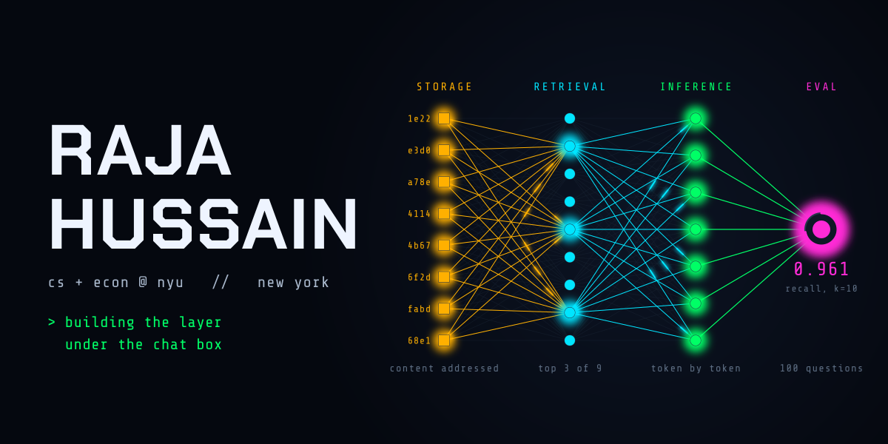
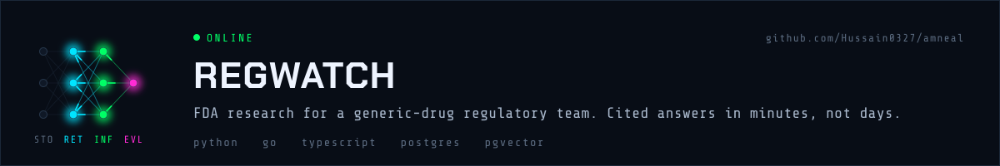
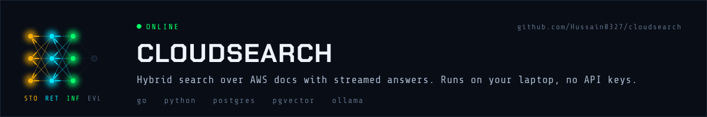
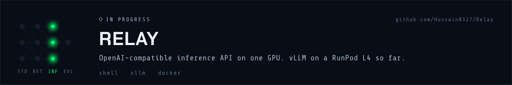
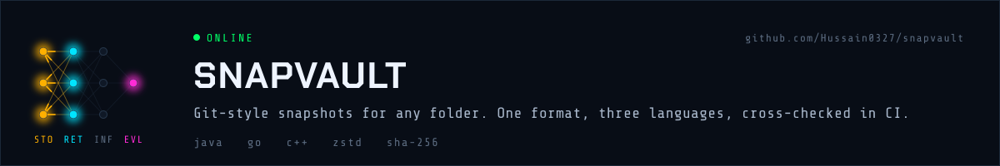

I study computer science and data science at NYU.
I like machine learning and AI most: training models, finding the right data
for them, serving them, and measuring whether they work.

Find me on [LinkedIn](https://www.linkedin.com/in/raja-hussain-ai), at
[raja-builds-ai.vercel.app](https://raja-builds-ai.vercel.app/), or by
[email](mailto:rajahh7865@gmail.com).

## What I work on

- **Models from data.**
  Feature engineering, gradient-boosted trees, and calibration, tested on
  data the model never saw.
- **Retrieval and RAG.**
  Hybrid search, embeddings, and answers with citations.
- **Inference.**
  Serving open models on a GPU, and routing each request to the right model.
- **Evals.**
  Fixed question sets in CI, so a drop in quality fails the build.

## Projects

[][regwatch]

FDA research for a generic-drug regulatory affairs team at Amneal.
Answers arrive in minutes, with the source and page behind every fact.

- Pins each question to one drug before retrieval, so answers never mix
  products.
- Refuses to state a fact without a source.
  A test enforces the rule, not the prompt.
- Says so in plain words when the evidence is thin, and logs one audit row
  per query.

[][cloudsearch]

Hybrid search over AWS documentation with streamed, cited answers.
No API keys. Runs on your laptop.

- Chunks the docs by structure and embeds them with BGE-large.
- Go runs vector and keyword search at once and fuses the results with
  Reciprocal Rank Fusion.
- Llama 3.2 through Ollama streams the answer with numbered citations.

[][relay]

An OpenAI-compatible inference API on one GPU. In progress.

- Milestone 1: an idempotent script brings up vLLM serving Llama 3 8B on a
  RunPod L4.
- Next: a FastAPI gateway with auth and rate limiting, then benchmarks for
  cost per million tokens.

[][snapvault]

Git-style snapshots for any folder, in Java, Go, and C++20 against one
frozen format.

- `snapvault find` fuses BM25 with static embeddings.
- A committed 100-question set holds the quality floor in CI.
  Recall 0.961, MRR 0.891 at k=10.

## More ML and data science

### [F1 Podium Predictor][f1]

Predicts a podium finish from pre-race data alone.
Trained on 2000 to 2019, tested on the unseen 2020 to 2024 seasons.

- 14 engineered features, each one known before the lights go out.
- Calibrated XGBoost reaches ROC-AUC 0.937 on the held-out seasons.
- SHAP ranks qualifying position first, with team form next.

### [semcache][semcache]

A drop-in proxy for LLM APIs which caches answers by meaning, not by exact
text.

- Embeds each prompt with MiniLM and looks for a close match in Redis.
- A SetFit classifier sorts queries by category, and each category gets its
  own match threshold.
- Versions the cache, so a prompt or RAG change never serves a stale answer.

### [Inference Router][router]

Research in progress: when does a learned router beat one frontier model?

- A small PyTorch gating network predicts quality, cost, and latency for
  each model and picks the best trade-off per request.
- Decides both which model answers and whether the query needs retrieval
  or tools.

### [SLM RAG Eval][slmeval]

Picks an open embedding model and a local LLM for a RAG system by testing
retrieval and answers apart.

- Recall@k and MRR for embedders, with a regression check against the
  current baseline.
- Answer, refuse, and citation checks with retrieval held fixed.
- Out-of-corpus requests stop before the LLM runs.

[regwatch]: https://github.com/Hussain0327/amneal
[cloudsearch]: https://github.com/Hussain0327/cloudsearch
[relay]: https://github.com/Hussain0327/Relay
[snapvault]: https://github.com/Hussain0327/snapvault
[f1]: https://github.com/Hussain0327/F1-Race-Outcome
[semcache]: https://github.com/Hussain0327/semcache
[router]: https://github.com/Hussain0327/Self-Optimizing-AI-Inference-Router
[slmeval]: https://github.com/Hussain0327/slm-rag-eval
